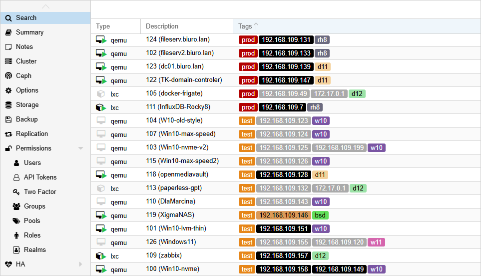

# Proxmox ip2tag

This script automatically assigns tags containing IP addresses to virtual 
machines and containers running in a Proxmox environment.



### Key Features:  

- Unified support for both LXC containers and virtual machines (VMs)  
- Separate color settings for active and inactive IP tags  
- Option to include only containers, only virtual machines, or both  
- Ability to enforce the position of added tags (at the beginning or end)  
- IP tag sorting for both running and stopped guests
- Define actions for inactive IPs (change color, remove, or do nothing)  
- Ability to filter tagged IPs based on selected CIDR networks  
- Separate ignore lists for IPs and VM/LXC IDs  
- Configurable interval for checking and updating IP tags  
- Can run as a systemd service or as a standalone script 
- Built-in config validation on startup to prevent runtime errors

## Automatic installation and upgrade

```sh
# Run as a root
 bash -c "$(curl -sSL https://github.com/MorsStefan/proxmox-ip2tag/raw/main/prox-ip2tag_install.sh)"
```

The script will automatically download all necessary files and perform a installation.  

If a previous version of the program is detected, it will be replaced **only after confirmation**.  
The original configuration file will remain untouched – the new config will be saved as:

`/usr/local/etc/prox-ip2tag.conf_<current_datetime>`

## Manual installation and upgrade

```
# Stopping service before installation or upgrade
systemctl stop prox-ip2tag.service &>/dev/null

# Download files
curl -sSL https://github.com/MorsStefan/proxmox-ip2tag/raw/refs/heads/main/prox-ip2tag -o /usr/local/bin/prox-ip2tag
curl -sSL https://github.com/MorsStefan/proxmox-ip2tag/raw/refs/heads/main/prox-ip2tag.conf -o /usr/local/etc/prox-ip2tag.conf
curl -sSL https://github.com/MorsStefan/proxmox-ip2tag/raw/refs/heads/main/prox-ip2tag.service -o /etc/systemd/system/prox-ip2tag.service

# Enable and run service
systemctl daemon-reload
systemctl enable --now prox-ip2tag.service

# Check status
systemctl status prox-ip2tag.service
```

## Configuration

The configuration file with all available options is located at: `/usr/local/etc/lxc-iptag.conf`

| Option                    | Default         | Description                                                                |
|---------------------------|-----------------|----------------------------------------------------------------------------|
| `use_ip_tags_for`         | `3`             | Defines which guest types to process: 1 = LXC, 2 = VM, 3 = both.           |
| `networks_range`          | `(0.0.0.0/0)`   | The IP address range (in CIDR format) in which IP must be located in order to be automatically added or removed as IP tag. |
| `ignored_vm_lxc_list`     | `()`            | Ignore these LXCs and VMs.                                                 |
| `ignored_ip_tag_list`     | `(127.0.0.1)`   | Do not auto add or remove these IP tags for VMs and LXCs, do not change their color.  |
| `inactive_ip_tag_action`  | `change_color`  | What to do with IP tags when VM/LXC is stopped: \[ `remove` \| `change_color` \| `none` \]. |
| `change_tags_colors`      | `1`             | Allow changing Proxmox default tags colors: \[ 0 \| 1 \].<br />Overwrites `inactive_ip_tag_action` when set to `change_color` or `none`. |
| `update_ip_tags_interval` | `60`            | Time in seconds between IP tags updates. Must be > 0. Minimum 60 is recommended. |
| `ip_tags_pos`             | `first`         | Controls the placement of newly added IP tags: \[ `first` \| `last` \].<br />Require: Datacenter->Options->Tag Style Override->Ordering='Configuration'  |
| `force_ip_tags_pos`       | `1`             | Enforces a fixed position for IP tags according to the value of the `ip_tags_pos`.<br /> Require: Datacenter->Options->Tag Style Override->Ordering='Configuration' |
| `tag_color`               | `ffffff`        | Foreground color for active IPs (hex).                                     |
| `tag_bgcolor`             | `000000`        | Background color for active IPs (hex).                                     |
| `tag_inactive_color`      | `ffffff`        | Foreground color for inactive IPs (hex).                                   |
| `tag_inactive_bgcolor`    | `aaaaaa`        | Background color for inactive IPs (hex).                                   |
| `read_vm_lxc_config_using`| `cfg_files`     | Method for reading tags and selected config options: \[ cfg_files \| qm_pct \].<br />cfg_files = fast (reads local config files), qm_pct = use default Proxmox tools.|
| `display_timestamp`       | `0`             | Prefixes each output line with a timestamp - useful for terminal logging.   |
| `VERBOSE`                 | `3`             | Verbosity level of log messages: \[ 0 \| 1 \| 2 \| 3 \| 4 \| 5 \| 6 \].<br />0-reserved, 1-errors, 2-warnings\|notice, 3-info, 4-verbose, 5-debug, 6-maximum  |

## Usage

By default, the program runs in an infinite loop, continuously monitoring IP addresses and their associated tags.   
However, it can be launched with the `--run-once` option to perform a one-time synchronization and exit afterward.  

### IP Discovery

By default, the script detects all IPv4 addresses (excluding 127.0.0.1) and assigns them as tags to virtual machines and LXC containers.   

To limit the range of detected IP addresses, you can define custom networks using the `networks_range` parameter. For example, to include common local networks:

````
networks_range=( 192.168.0.0/16 10.0.0.0/8 )
````
IP addresses that should be ignored must be added to the `ignored_ip_tag_list` variable.
This list can also include existing IP tags that you don't want to modify. If, for example, docker is
installed in LXCc and we do not want its internal container (docker) addresses are added as tags:   

````
ignored_ip_tag_list=( 127.0.0.1 172.17.0.1 172.17.0.2 172.18.0.1 172.18.0.2 )
````

This also works the other way around, if these addresses were already assigned as tags to a
container, they will not be automatically removed when added to the `ignored_vm_lxc_list`.   

They will be ignored, just as the variable name suggests.   

 Note that this variable accepts specific IP addresses, not ranges as in `networks_range`.   

### Tags order

The order in which IP tags are displayed depends on both the script's configuration and the cluster's global settings.  
To ensure correct IP tag sorting and position enforcement, the parameter:   
`Datacenter -> Options -> Tag Style Override -> Ordering` should be set to `Configuration`.

Please note that IP tags are not automatically sorted in the following cases:   
- The VM/LXC is listed in the ignored machines list  
- The IP address is listed in the ignored tags list  
- The guest agent is not installed in the virtual machine (VM)  
- Datacenter `Tag Style Override -> Ordering` is not set to `Configuration`
- `force_ip_tags_pos` is set to `0` in `/usr/local/etc/prox-ip2tag.conf`

### Tags colors

By default, when a virtual machine associated with an IP tag is shut down,
the color of the IP tag is updated to indicate its inactive state.   

If the same IP address is assigned to more than one machine — with one running
and the other stopped — the tag color will be determined by the running machine.
This behavior results from the fact that tag color changes are applied globally
and cannot differ per machine.

**Important note:**

Tag color changes are not visible immediately. Press `F5` to refresh the view.
This is not a bug, but a limitation/feature of the Proxmox interface.

### Practical tip for new users

This is not a required step, but it allows for a quick and trouble-free script setup.

1. Stop the service: `systemctl stop prox-ip2tag`
2. In the file `/usr/local/etc/prox-ip2tag.conf`, set `VERBOSE=4` and `update_ip_tags_interval=5`
3. Set two options in the Proxmox configuration::   
   `Datacenter -> Options -> Tag Style Override -> Ordering` = `Configuration`  
   `Datacenter -> Options -> Tag Style Override -> Tree Shape` = `Full`
4. Run in terminal: `/usr/local/bin/prox-ip2tag` and observe the output

This way, all running virtual machines and containers will receive IP tags.
They will be placed at the beginning of the tag list, making them easier to view and sort -
especially in the `Datacenter -> Search` view.

If available memory is limited on the server, you can start virtual machines one by one,
and shut them down after they get IP tags. Once all machines have tags assigned, you can stop the script (`Ctrl + C`).   

You can now make configuration changes and check the effect by running the script manually again.   
With the above settings, changes should be visible within 60 seconds after launch.

Once the result is satisfactory, you may reduce the `VERBOSE` level, increase `update_ip_tags_interval`,
and run the script as a systemd service.

## Uninstall

```sh
# stop and disable prox-ip2tag.service
systemctl stop prox-ip2tag.service
systemctl disable prox-ip2tag.service

# remove prox-ip2tag
rm -fv /etc/systemd/system/prox-ip2tag.service
rm -fv /usr/local/bin/prox-ip2tag
rm -fv /usr/local/etc/prox-ip2tag.conf
```

## Roadmap

- ~~Sorting of tags also for stopped VMs and LXCs~~ [0.7.6]
- Reading IP addresses from stopped LXC containers
- Alternative configuration reading methods using `pvesh get`
- Replace 'ignored_ip_tag_list' with 'ignored_ip_tag_range'
- Tool to remove all IP tags
